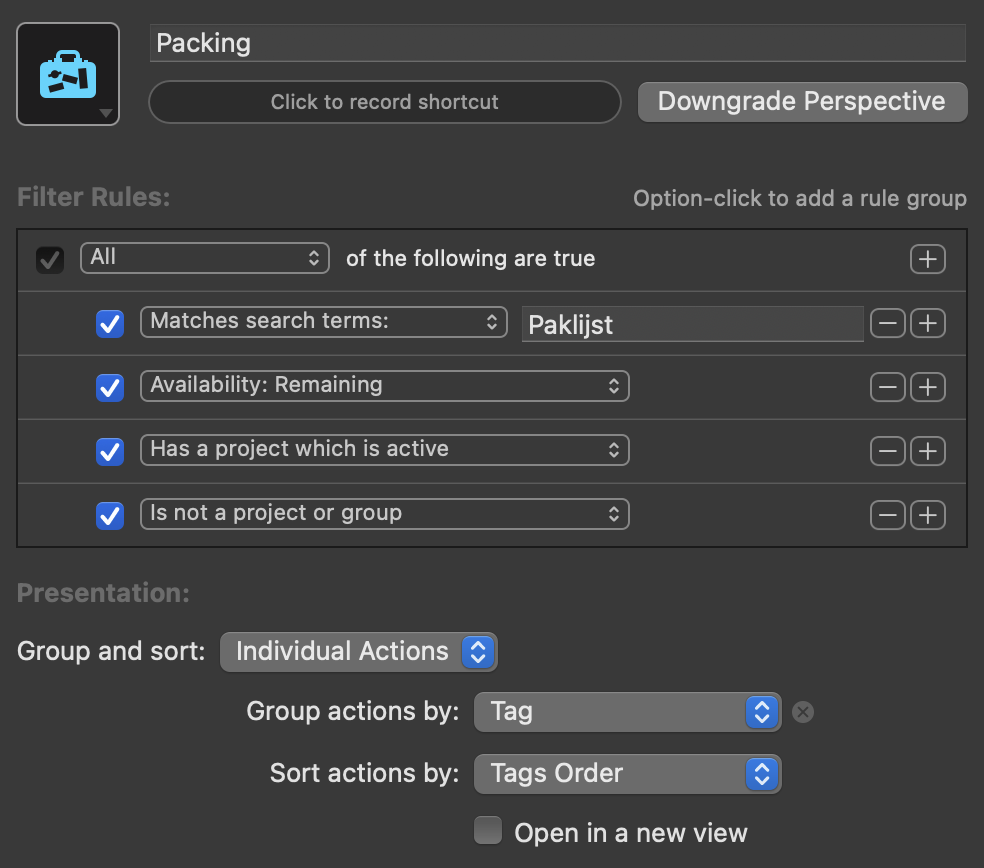

# Paklijst

An automation to create packing lists in OmniFocus

## Installation
Download the `paklijst.omnifocusjs` file from this repo and place it in 

## Workflow
- Copy the contents of `template.taskpaper` into OmniFocus (you can just copy the plain content and press CMD+V with a project selected in in OmniFocus' project view)
- Make it a "Single Actions" project, and put its status "On Hold"
- Create a "Packing" perspective that searches for items matching "Paklijst"
- When it's time to start packing, run the automation
- Pick categories that are relevant for the trip and select start and end dates
- This will create a new project "Paklijst <Trip Title>"

## Tips

When something can be in multiple places, I add multiple tags, so that I get reminded at every location

If the same item is on multiple categories, it will only be added once to the final packing list

You can calculate number of items with number of days the trip will take

Flagging a category in the "[Paklijst Template]" makes it selected by default

This is what your "Packing" perspective should look like:

